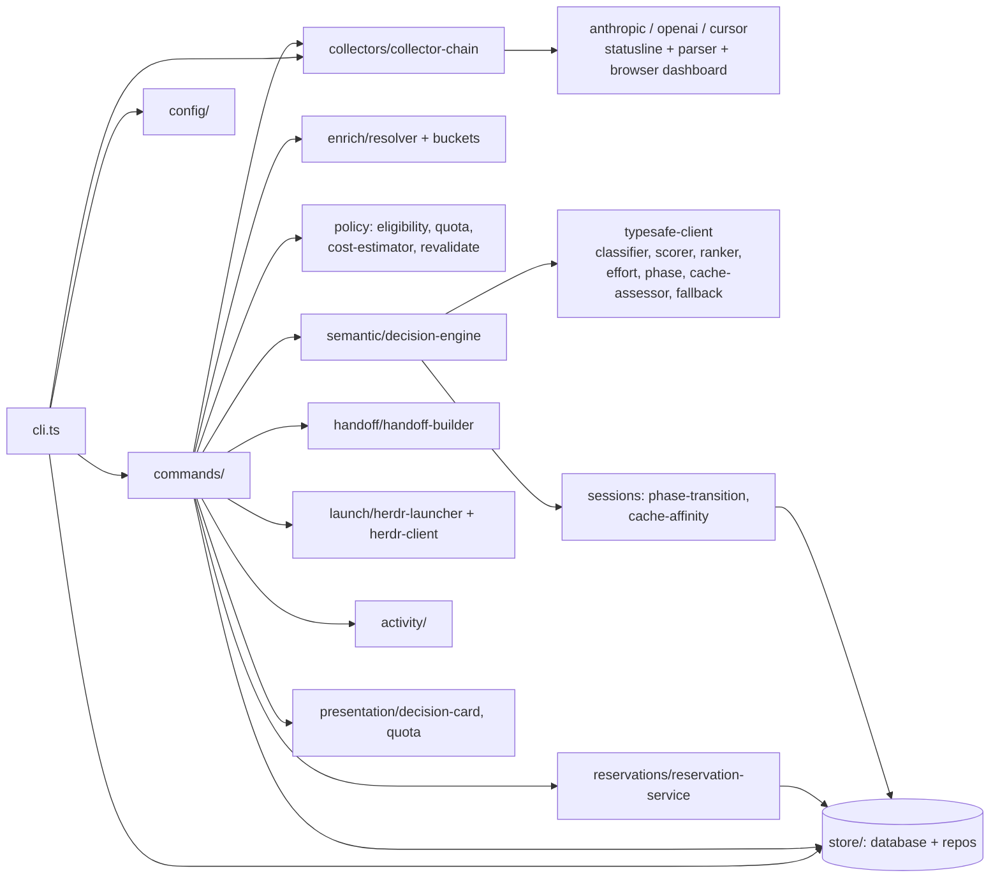

# Repo Map: agent-router

npm workspaces monorepo (TypeScript, Node 20+, vitest). ~4.4k LOC in `packages/router/src`.

## Packages

| Path                        | Role                                                                                                              |
| --------------------------- | ----------------------------------------------------------------------------------------------------------------- |
| `packages/router`           | Core CLI `router`: picks agent + model + effort, launches it in a Herdr pane                                      |
| `packages/coordinator`      | Cloudflare Worker (`wrangler.toml`, D1 `migrations/0001_leases.sql`): shared-account lease coordination with auth |
| `packages/hermes-heartbeat` | Client lib: request wrapper + fingerprinting, heartbeats to coordinator                                           |
| `skills/model-router`       | Agent skill wrapping the CLI (SKILL.md, CLI reference, prompt tests)                                              |
| `herdr-plugin/`             | Shell glue for Herdr: route, resume, sessions, status, usage-refresh                                              |
| `docs/`                     | configuration, operations, privacy, provider-support, superpowers specs/plans                                     |

## `router run` flow

Edges verified against the graphify AST graph (cross-directory edge counts, e.g. cli→commands 22,
commands→collectors 21, commands→launch 16, commands→store 16, reservations→store 11).
`commands/` is the hub: policy and semantic are called side by side from it (0 direct edges between
them), and collectors never touch the store directly (commands/cli persist their output).

Pipeline: load config → enrich task refs → collect quota → deterministic policy filter (enabled models, quota, 40% shared reserve) → TypeSafe ranks + picks effort → reserve capacity → build handoff → launch in Herdr → audit.

## Module index (`packages/router/src`)

| Dir                                                                   | Key files                                                  | Purpose                                            |
| --------------------------------------------------------------------- | ---------------------------------------------------------- | -------------------------------------------------- |
| `commands/`                                                           | run (399), runtime (212), session, status, usage, accounts | CLI subcommands                                    |
| `semantic/`                                                           | decision-engine (237), typesafe-client + scorers           | LLM-assisted ranking; no fallback if TypeSafe down |
| `enrich/`                                                             | resolver (279), buckets                                    | Resolve file/ref context in task text              |
| `collectors/`                                                         | registry, collector-chain, command-runner, per-provider    | Read usage/quota from agent CLIs                   |
| `policy/`                                                             | eligibility, quota, cost-estimator, revalidate             | Hard rules before ranking                          |
| `launch/`                                                             | herdr-launcher (185), herdr-client, agent-command          | Spawn agent in pane                                |
| `store/`                                                              | database + repositories                                    | Local persistence                                  |
| `domain/`                                                             | schemas, usage, session, account, model-profile            | Types + zod-style schemas                          |
| `config/`                                                             | config-schema, config-loader                               | `config.example.json`, `.env`                      |
| `catalog/`, `activity/`, `reservations/`, `handoff/`, `presentation/` |                                                            | Supporting services                                |

Tests mirror `src/` in `packages/router/test/` (+ `e2e/`, `fixtures/`). Routing evals: `packages/router/evals/routing-cases.json`. Model catalog: `packages/router/config/models.json`.

## Graphify-verified hubs (AST graph: 717 nodes, 1885 edges, 30 communities)

Most-connected nodes: `commands/run.ts` (66 edges), `commands/runtime.ts` (58), `domain/schemas.ts` (54),
`cli.ts` (48), `domain/account.ts` (45), `domain/usage.ts` (43), `semantic/decision-engine.ts` (37),
`collectors/normalizer.ts` `normalizeUsage()` (30), `domain/model-profile.ts` (30), `collectors/registry.ts` (29).

Communities line up with directories: domain+policy, collectors, commands+cli, launch+handoff,
semantic+sessions, store+config, enrich, reservations, coordinator leases, hermes-heartbeat.
Cross-package coupling is minimal (coordinator/hermes-heartbeat → router: 2 edges each).

## Hotspots (review first)

1. `commands/run.ts` (399 LOC): orchestrates everything; biggest file, most fan-out (~15 imports). Split candidate.
2. `enrich/resolver.ts` (279): parses task text and file refs, so check for path-traversal/privacy.
3. `semantic/decision-engine.ts` (237): hard dependency on TypeSafe; no offline fallback.
4. `commands/runtime.ts` (212) + `domain/schemas.ts`: second- and third-most-connected; changes ripple widely.
5. `cli.ts` (253): wires store + collectors directly; the composition root.
6. `coordinator/src/auth.ts` + `leases.ts`: network-facing, security-sensitive.
7. `launch/herdr-launcher.ts` (185): shell/process spawning.
